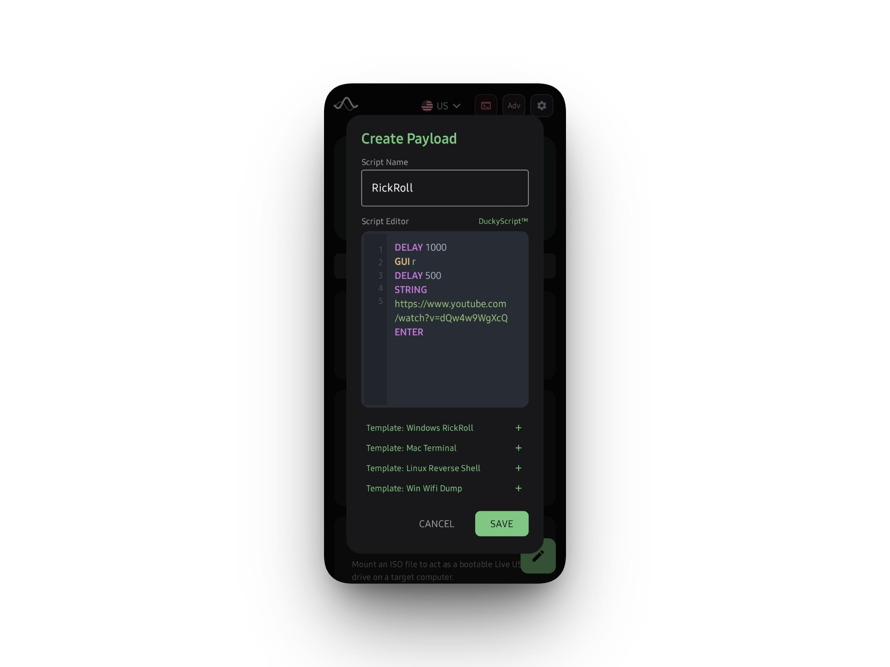

# Chimera Technical Documentation

Chimera skips the Android framework completely and writes straight to the Linux kernel. If you have root, you can spoof hardware, bind raw character devices, and force the target machine to run whatever you want.

## 1. Engine Breakdowns

Forget the abstraction layers. Here's how this actually runs under the hood.

*   **The Parser**: Grabs your DuckyScript and spits out byte arrays. It lives in Kotlin and handles the UI syncing.
*   **Gadget Controller**: A nasty root shell wrapper that binds USB endpoints directly inside `/config/usb_gadget`. It tells the host OS "I'm a keyboard" and hooks the UDC. 
*   **Hardware Scanner**: Pure C++ JNI code. It bypasses the JVM to aggressively read `sysfs` nodes so we aren't burning memory just to check if `usb0` exists.

## 2. Attack Vectors

### 2.1 Direct HID Injection
This forces the Android kernel to fake a class-compliant USB keyboard. 
*   **The Blueprint**: We build a gadget profile in `/config/usb_gadget/chimera`, push an 8-byte keyboard report descriptor, and bind it to `/dev/hidg0`.
*   **Execution**: The parser rips through a DuckyScript payload and translates `STRING` or `ENTER` into HID interrupts. 
*   **Wait For It**: You need a kernel compiled with `CONFIG_USB_CONFIGFS_F_HID`. Also, writes to char devices are synchronous. If you dump 10,000 keystrokes instantly, the Coroutine will stall until the kernel confirms every single write. Don't run this on the main thread unless you want a massive ANR crash.

### 2.2 Bluetooth LE HID Injection
When the OEM kernel completely locks out ConfigFS—or you can't plug in a cable—we hijack the native `BluetoothHidDevice` API.
*   We spoof an input device (Bluetooth Class `0x0540`).
*   Establish an L2CAP channel and dump over-the-air keystrokes. It's slower than `hidg0`, but no one questions a random Bluetooth keyboard pairing request.

### 2.3 RNDIS C2 Dashboard
We bind an Ethernet-over-USB interface so you get an out-of-band connection right into the target.
*   **Target Subnet**: Android starts handing out DHCP leases on `10.0.0.1/24`. Your phone is the gateway. 
*   **The Server**: I wrote a raw multi-threaded `ServerSocket` bound to TCP Port 80. It serves up a dirty HTML dashboard so you can swap attack scripts on the fly without touching the phone screen.

### 2.4 Mass Storage Loot Zone
Forces Android to emulate a fat block-level storage device.
*   **How it mounts**: We bind a pre-formatted backing image (FAT32/exFAT) to `/config/usb_gadget/chimera/functions/mass_storage.0/lun.0/file`.
*   Now you have a 64MB flash drive mapped to the target. Use it to drop binaries or exfiltrate files.

### 2.5 Payload Management
We don't expect you to type complex scripts on a phone keyboard.
*   **Payload Editor**: An on-device editor to tweak downloaded scripts or write new ones before execution.
*   **Local Import**: Grab existing `.txt` or `.bin` scripts straight from your phone's storage. 
*   **Hak5 Integration**: Search and pull payloads directly from the Hak5 GitHub repository inside the app. 

<p align="center">
  
  
</p>

## 3. Don't Skip This

### Check Your Hardware
Run this in a root shell right now:
```bash
ls /sys/class/udc/
```
If that directory is empty, your kernel doesn't have a USB Device Controller driver. You can't spoof USB hardware. Go flash a custom kernel. 

### Windows Hates You
*   **Mount Delays**: Windows takes its sweet time mounting generic USB drivers. If you don't slap `DELAY 1000` at the top of your script, your first commands will just drop into the void. 
*   **Composite Driver Hell**: If you try to spoof a keyboard (HID) and RNDIS at the same time, Windows will probably freak out over driver signatures and refuse to bind them. EDRs hate unsigned composite devices. Stick to single-function payloads if you want to stay quiet.

## 4. Why Is It Failing?

You will break things. Here's why.

*   **SELinux is Killing You**: You have root, but the UI says "LOCKED". SELinux is dropping your writes to `/config/usb_gadget`. Run `setenforce 0` in a root shell, or inject a custom permissive policy. 
*   **Missing UDC**: When the app tries to bind the gadget by echoing `$UDC_NAME > UDC`, and it panics—your OEM stripped the underlying driver (like `dwc3`). Build the module yourself or flash NetHunter.
*   **Target Ignores Keystrokes**: Sometimes you write to `/dev/hidg0` and the target machine doesn't react. Your kernel's default 8-byte report descriptor is probably garbage. You'll need to overwrite the descriptor array inside the ConfigFS endpoint manually.

## 5. Messing With The Code

I wrote all the hardware interactions using strict JNI bridging. Look at these before you compile. 

*   **Toolchain**: You need NDK v25+, Java 17, and API 34. 
*   **CMake Paths**: If your `local.properties` file isn't pointing directly to your NDK path, the C++ hardware scanner will refuse to compile.
*   **Keep IO Off The Main Thread**: If you make a Coroutine touch `/dev/hid*` and you accidentally leave it on `Dispatchers.Main`, you will crash the app. Always use `Dispatchers.IO`. 
*   **Adding New Gadgets**: Want to spoof a serial port (ACM) or MIDI? You have to edit `GadgetController.kt`, drop the new function tag into `functions/`, and bind it to `configs/c.1/` before you awaken the UDC.