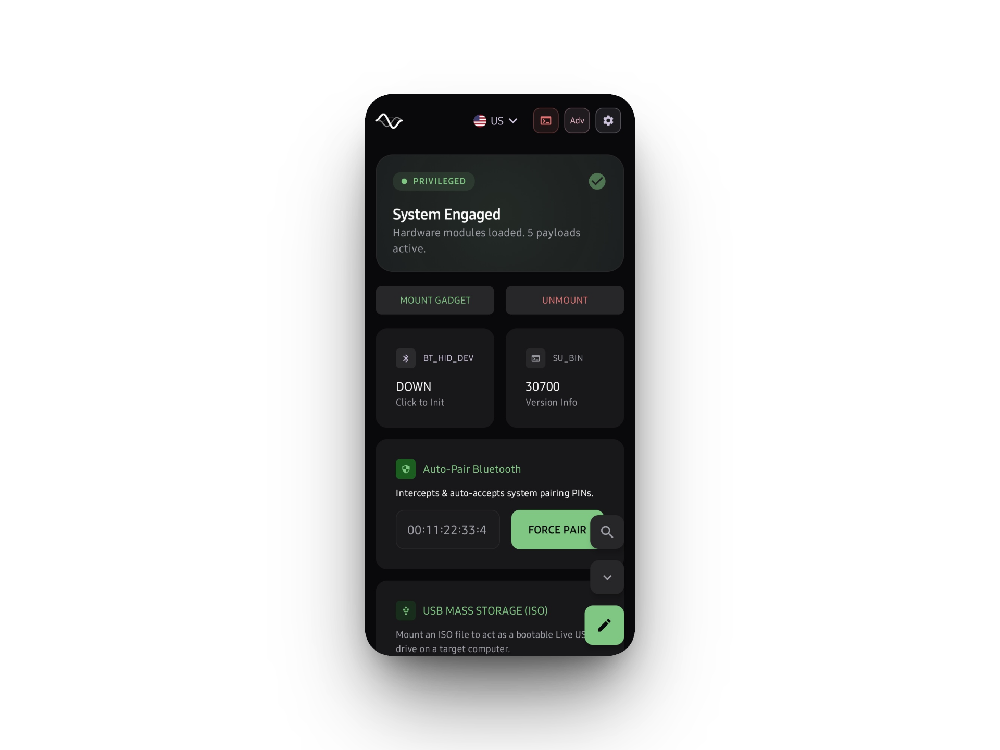
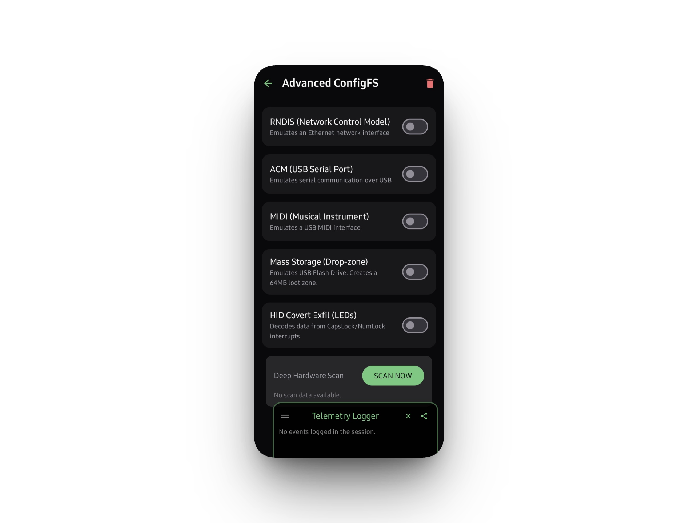

<div align="center">
  
  <h1>Chimera</h1>
  <p>Hardware Emulation & Proximity Exploitation</p>
  
  
</div>

---

## The Pitch

I got sick of lugging around a backpack full of Hak5 gear and cables. I already have a Linux machine in my pocket, so I figured out how to force Android to handle the HID and RNDIS stuff natively. 

Chimera binds directly to your kernel's ConfigFS. It spits out payloads, spoofs block devices, and sets up an out-of-band C2 over USB Ethernet. You plug your phone into a target server, tell it to impersonate a keyboard, and start dumping keystrokes into `/dev/hidg0`. No middleware. 

<p align="center">
  
  
  
</p>

## What It Actually Does

*   **Raw HID via ConfigFS**: We bypass all the high-level Android garbage and write bytes straight to `/dev/hidg0`. It's instant. EDRs usually don't care because it looks like a cheap Dell keyboard.
*   **On-phone DuckyScript Compiler & Editor**: Write your script in the app using the built-in payload editor. The compiler parses it and fires the interrupts right away. You don't need a laptop.
*   **Payload Management**: Import your own `.txt` paylods directly from your phone's storage, or search and pull from the Hak5 community repo right inside the app.
*   **OOB C2 via RNDIS**: Forces your phone to fake a USB Ethernet interface (`usb0`). It spins up a tiny embedded web server so you can swap payloads from another device or just monitor what's going on. Windows loves RNDIS and usually installs it instantly. macOS will fight you on it because Apple hates non-standard composite signatures.
*   **Bluetooth LE HID**: When the target has locked down physical USB ports, pivot to the native L2CAP Bluetooth API and fire keystrokes over the air. It works.
*   **Fake Mass Storage**: Maps a raw `.bin` or `.img` to `usb_f_mass_storage`. Boom, your phone is now a 64MB flash drive. Drop your binaries or steal loot. 

## The Stack

It's a mix of Kotlin UI stuff and dirty C++ JNI hooks. 
*   **UI**: Jetpack Compose.
*   **Coroutines**: Handling I/O against char devices so we don't completely lock up the main thread when dumping a 5MB payload script.
*   **JNI Hooks**: C++ code that skips the JVM entirely to aggressively read `sysfs` nodes and figure out what hardware your kernel actually supports.

## Getting It Running

You can't just install this on a clean pixel and expect it to work. You need root. Period.

1.  Magisk, KernelSU, APatch. I don't care, just get root.
2.  Your kernel must have `CONFIG_USB_CONFIGFS` and `CONFIG_USB_CONFIGFS_F_HID` compiled in. Stock kernels usually strip this. Go flash NetHunter. 
3.  Need Android 11+ for the wireless BT stuff.

> **Hardware RNG:** Bluetooth HID is pretty stable everywhere. The wired ConfigFS modules? Total crapshoot. It highly depends on your OEM's kernel. I've got this running on my own dirty testing rig. If you get the wired shit working on a random OnePlus or ancient Pixel with a custom NetHunter/KernelSU setup, drop your `dmesg` logs in the Issues tab so I can map out what actually works.

## Compile It

```bash
git clone https://github.com/cipher-attack/chimera.git
cd chimera
# Fix your local.properties so CMake knows where your NDK is, otherwise JNI compilation will instantly die.
./gradlew assembleDebug
```

## Don't Be Stupid (OpSec & Quirks)

*   Target OS stacks need time to mount the HID driver. If you instantly start blasting keystrokes, the first 10 characters are going into the void. Use `DELAY 1000`.
*   Android's Doze mode is aggressive. If your screen turns off, the OS will usually kill your background Coroutines. Exempt Chimera from battery optimizations or you'll lose your C2 connection mid-execution. Same goes for the OS putting apps to sleep.

## Docs
Go read [DOCUMENTATION.md](DOCUMENTATION.md) for the actual JNI bridge details and why building composite USB interfaces is such a headache. Also, before opening a PR or asking for help, read the [CONTRIBUTING.md](CONTRIBUTING.md) and [CODE_OF_CONDUCT.md](CODE_OF_CONDUCT.md) files.

## Downloads

*   **[Download Release APK](https://github.com/cipher-attack/chimera/releases/latest/download/app-release.apk)** (Optimized, stripped, for everyday ops)
*   **[Download Debug APK](https://github.com/cipher-attack/chimera/releases/latest/download/app-debug.apk)** (Verbose logging, use this if you're trying to figure out why your ConfigFS payload failed)

## Who

*   [Telegram](https://t.me/cipher_attacks)
*   [GitHub](https://github.com/cipher-attack)
*   Email: [birukgetachew253@gmail.com](mailto:birukgetachew253@gmail.com)

**Disclaimer:** I wrote this for red teamers and physical engagements. Get explicit permission before plugging your phone into someone's rack.

